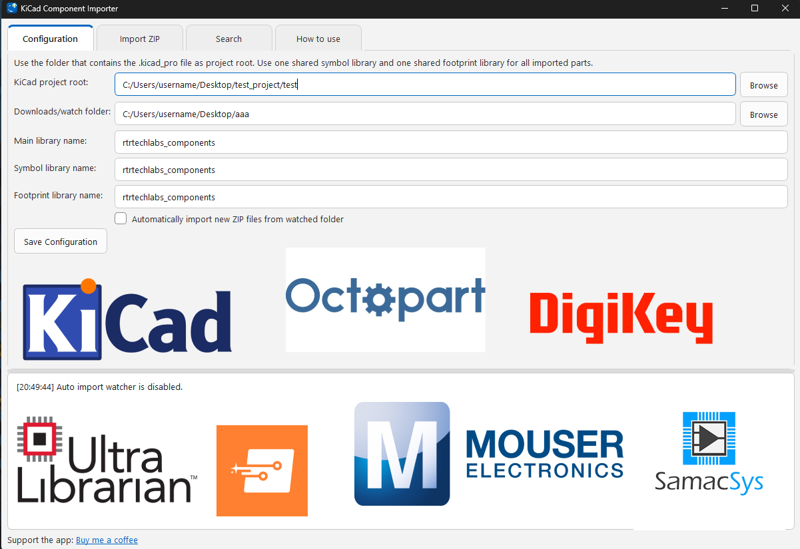

# Component Importer for KiCad

An open source desktop app for importing downloaded component ZIP libraries into KiCad projects.

<p align="center">
  
</p>

Linux support is available for Ubuntu, Zorin OS, Pop!_OS, and close Ubuntu-based distributions. See [Linux support notes](docs/LINUX.md).

See the [installation guide](docs/INSTALL.md) for Windows and Linux setup steps.

[ Join the Discord](https://discord.gg/hnFYPJp6CK)

Support the project: [Buy me a coffee](https://buy.stripe.com/cNieVeg1c7xbalm0CEdnW00)

## What It Does

Component Importer for KiCad helps keep third-party component ZIPs organized inside a KiCad project. It can import symbols, footprints, 3D models, datasheets, and metadata into project-local libraries, then register those libraries with the project.

It is designed for workflows where you download component ZIP files from CAD/library providers and want them merged into one clean project component library.

## Features

- Imports component ZIP files into project-local KiCad libraries.
- Creates and registers symbol and footprint libraries for the project.
- Copies 3D models, datasheets, source ZIPs, and metadata into organized folders.
- Links imported symbols to their imported footprints automatically.
- Watches a downloads folder and can auto-import new component ZIP files.
- Provides provider search links from inside the app.
- Shows simple import confirmations and keeps detailed file backups automatically.

## Download

Windows installer:

[KiCadComponentImporter_Setup.exe](https://github.com/robertxdx/component-importer-for-kicad/releases/latest/download/KiCadComponentImporter_Setup.exe)

Linux installer:

[KiCadComponentImporter-linux-x86_64.tar.gz](https://github.com/robertxdx/component-importer-for-kicad/releases/latest/download/KiCadComponentImporter-linux-x86_64.tar.gz)

All release assets are available on the [latest release page](https://github.com/robertxdx/component-importer-for-kicad/releases/latest).

Linux builds can be created from source on a Linux machine using the packaging command below. See the [installation guide](docs/INSTALL.md) and [Linux support notes](docs/LINUX.md) for Ubuntu, Zorin OS, and Pop!_OS testing guidance.

## First Use With KiCad 10

KiCad 10 can keep project library tables loaded in memory while a project is open. For the first setup, do this:

1. Create or open your KiCad project once so the project folder exists.
2. Close KiCad fully, including the project window, schematic editor, and PCB editor.
3. Open Component Importer for KiCad.
4. In the Configuration tab, select the KiCad project root folder.
5. Name your components library.
6. Select the folder where you download component ZIP files.
7. Save the configuration.
8. Open KiCad again and start importing components.

After the project library already exists and KiCad has loaded it, importing new parts into that same library should not require closing KiCad every time.

## Build From Source

Requirements:

- Windows or Linux
- Python 3.10 or newer
- PyQt6
- PyInstaller, only needed to build release bundles
- Inno Setup 6, only needed to build the Windows installer

Install Python dependencies:

```powershell
python -m pip install -e ".[build]"
```

Run the app from source:

```powershell
python -m component_importer.gui_main
```

Build the Windows installer:

```powershell
powershell -ExecutionPolicy Bypass -File packaging\build_windows_installer.ps1
```

The installer is written to `release_builds/<timestamp>/KiCadComponentImporter_Setup.exe`.

Build a Linux bundle on Linux:

```bash
bash packaging/build_linux_bundle.sh
```

The Linux archive is written to `release_builds/<timestamp>/KiCadComponentImporter-linux-<arch>.tar.gz`.
After unpacking it, run `./run.sh`, or run `./install_desktop_entry.sh` to add a user-level launcher.

## Notes

This is an independent open source project. It is not affiliated with, endorsed by, or maintained by the KiCad project.

KiCad and related names belong to their respective owners.

## License

MIT License. See [LICENSE](LICENSE).
