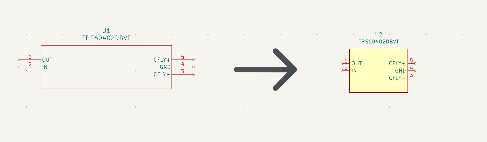

# KiCad Component Importer — Import Symbols, Footprints and 3D Models

Import downloaded electronic component ZIP files into organized KiCad symbol and footprint libraries.

[](https://github.com/robertxdx/component-importer-for-kicad/releases/latest)
[](LICENSE)
[](docs/INSTALL.md)
[](docs/LINUX.md)

<p align="center">
  
</p>

**Component Importer for KiCad** is an open-source desktop application that turns downloaded component ZIP files into clean, registered KiCad libraries.

It imports KiCad symbols, footprints, 3D models and datasheets into either:

- A library belonging to the current KiCad project
- A global KiCad library available from every project
- Both destinations at the same time

The application is useful when downloading components from CAD-library services such as SnapMagic/SnapEDA, ComponentSearchEngine/SamacSys or Ultra Librarian.

[Download for Windows](https://github.com/robertxdx/component-importer-for-kicad/releases/latest/download/KiCadComponentImporter_Setup.exe) ·
[Download for Linux](https://github.com/robertxdx/component-importer-for-kicad/releases/latest/download/KiCadComponentImporter-linux-x86_64.tar.gz) ·
[Installation guide](docs/INSTALL.md) ·
[Discord community](https://discord.gg/hnFYPJp6CK)

## Why use a KiCad component importer?

A downloaded component package can contain several separate files:

- A `.kicad_sym` symbol library
- One or more `.kicad_mod` footprints
- STEP, WRL or STL 3D models
- A PDF datasheet
- Additional folders and provider metadata

Importing these files manually means deciding where each file belongs, merging symbols, registering libraries, assigning footprints and correcting 3D-model paths.

Component Importer automates that process.

Select a ZIP file and the application will:

1. Inspect the archive and identify supported KiCad assets.
2. Merge symbols into the selected symbol library.
3. Copy footprints and 3D models into organized library folders.
4. Assign the imported footprint to the symbol.
5. Repair the footprint's 3D-model reference.
6. Register the symbol and footprint libraries with KiCad.
7. Validate the completed import.
8. Preserve the source ZIP, metadata and backups.

## Project libraries and global libraries

The importer supports two KiCad library workflows.

### Project library

A project library belongs to one KiCad project. Its symbols, footprints and models are stored inside the project folder and registered in that project's library tables.

Use this mode when:

- The component is specific to one design.
- The project must remain portable and self-contained.
- You do not want the component visible in unrelated projects.

### Global library

A global library is stored outside the project and registered in KiCad's user library tables. Its components are available when working on other projects.

Use this mode when:

- You expect to reuse the component.
- You maintain a personal KiCad component library.
- Multiple projects should access the same symbol and footprint.

You can enable **Also import components into a KiCad global library** to import every component into both destinations.

The external library folder contains the actual component files. The KiCad global configuration folder only contains `sym-lib-table` and `fp-lib-table`, which tell KiCad where the external libraries are located.

## Features

- Import KiCad component ZIP files
- Merge symbols into an existing `.kicad_sym` library
- Import one or multiple `.kicad_mod` footprints
- Import STEP, STP, WRL and STL 3D models
- Copy PDF datasheets and source ZIP files
- Create project-local KiCad libraries automatically
- Import into persistent global KiCad libraries
- Register libraries in `sym-lib-table` and `fp-lib-table`
- Link imported symbols to their footprints
- Repair 3D-model paths inside footprints
- Apply optional KiCad-style symbol formatting
- Detect and skip components already in a library
- Watch the Downloads folder for new ZIP files
- Automatically import completed downloads
- Search multiple electronic component providers
- Start automatically when the user signs in
- Continue running from the system tray
- Create backups before modifying library files
- Validate symbols, footprints, models and library registration
- Support Windows and Ubuntu-based Linux distributions

## Supported files

| Asset | Supported formats | Import destination |
|---|---|---|
| KiCad symbols | `.kicad_sym` | Selected symbol library |
| KiCad footprints | `.kicad_mod` | Selected `.pretty` library |
| 3D models | `.step`, `.stp`, `.wrl`, `.stl` | 3D-model library folder |
| Datasheets | `.pdf` | Metadata folder |
| Source archive | `.zip` | Source ZIP folder |
| Import information | `.json` | Metadata folder |

Unsupported files inside an archive are ignored.

## Automatic KiCad symbol formatting

<p align="center">
  
</p>

Downloaded symbols do not always match the appearance of native KiCad symbols. Optional formatting can normalize imported symbols before they are added to the library.

Formatting can:

- Apply KiCad-style body outlines and fill colors
- Normalize symbol text size
- Normalize pin lengths
- Remove cramped custom pin-name offsets
- Adjust simple rectangular symbol bodies
- Improve pin spacing and symbol proportions

Formatting only affects symbols imported by the application. It can be disabled when the original provider formatting should be preserved.

## Download

### Windows

Download and run:

[**KiCadComponentImporter_Setup.exe**](https://github.com/robertxdx/component-importer-for-kicad/releases/latest/download/KiCadComponentImporter_Setup.exe)

The installer creates an application shortcut and can optionally configure startup on login.

### Linux x86_64

Download:

[**KiCadComponentImporter-linux-x86_64.tar.gz**](https://github.com/robertxdx/component-importer-for-kicad/releases/latest/download/KiCadComponentImporter-linux-x86_64.tar.gz)

Extract the archive and start the application:

```bash
./run.sh
```

To add it to the desktop application menu:

```bash
./install_desktop_entry.sh
```

Linux testing currently focuses on Ubuntu, Zorin OS, Pop!_OS and closely related Ubuntu-based distributions. See the [Linux support notes](docs/LINUX.md).

All available packages can be found on the [latest release page](https://github.com/robertxdx/component-importer-for-kicad/releases/latest).

## Quick start

### 1. Prepare the KiCad project

Create or open the KiCad project once so its folder and `.kicad_pro` file exist.

Close KiCad before configuring a new library for the first time. KiCad may keep symbol and footprint library tables loaded while its editors are open.

### 2. Configure the importer

Open the **Configuration** tab and select:

- **KiCad project root** — the folder containing the `.kicad_pro` file
- **Downloads/watch folder** — where component ZIP files are downloaded
- **Library name** — the project symbol and footprint library name

To also create or reuse a global library, enable the global-library option and configure:

- **Global library folder** — external storage for the actual library files
- **Global library name** — the name displayed in KiCad
- **KiCad global config folder** — the version folder containing KiCad's global library tables

The KiCad global configuration folder is detected automatically when possible.

### 3. Choose symbol formatting

Open the **Symbol Style** tab to enable or disable formatting and select the desired appearance.

### 4. Import a component

Open the **Import ZIP** tab, choose a component archive and click **Import ZIP**.

The application imports and validates the component, then displays a confirmation.

### 5. Reopen KiCad

After creating a project or global library for the first time, reopen KiCad so it reloads the updated library tables.

Future components added to the same registered library normally do not require restarting KiCad.

## Automatic Downloads-folder importing

The importer can watch a selected Downloads folder while running.

When a new ZIP appears, it waits for the file to finish downloading and then:

1. Determines the component name.
2. Imports it into the configured destination or destinations.
3. Formats the symbol if enabled.
4. Validates the imported files.
5. Displays a completion notification.

The application can stay minimized in the system tray and optionally start when the user signs in.

## Component search

The Search tab creates component-search links for:

- SnapMagic / SnapEDA
- ComponentSearchEngine / SamacSys
- Ultra Librarian
- DigiKey
- Mouser
- Octopart

Search by manufacturer part number or keyword, then open one or more provider results in the default browser.

The application does not download provider files automatically. Download the desired KiCad ZIP from the provider and import it through the Import ZIP tab or watched folder.

## Safety and backups

Downloaded ZIP files are inspected before extraction.

The importer protects against:

- ZIP path traversal
- Absolute or unsafe archive paths
- Encrypted archive entries
- Excessive archive entry counts
- Oversized supported files
- Excessive total uncompressed asset size
- Accidental filename traversal outside library folders

Backups are created before existing symbols, footprints, metadata or library tables are modified.

## Build from source

Requirements:

- Python 3.10 or newer
- PyQt6
- PyInstaller for release builds
- Inno Setup 6 for Windows installer builds

Clone the repository and install it:

```bash
git clone https://github.com/robertxdx/component-importer-for-kicad.git
cd component-importer-for-kicad
python -m pip install -e ".[build]"
```

Run from source:

```bash
python -m component_importer.gui_main
```

Run the automated tests:

```bash
python -m unittest discover -s tests -v
```

Build the Windows installer:

```powershell
powershell -ExecutionPolicy Bypass -File packaging\build_windows_installer.ps1
```

Build the Linux bundle on a Linux system:

```bash
bash packaging/build_linux_bundle.sh
```

Release files are written beneath `release_builds/<timestamp>/`.

## Documentation and support

- [Installation guide](docs/INSTALL.md)
- [Linux support notes](docs/LINUX.md)
- [Discord community](https://discord.gg/hnFYPJp6CK)
- [Report an issue](https://github.com/robertxdx/component-importer-for-kicad/issues)

If the application saves time in your KiCad workflow, you can [support the project](https://buy.stripe.com/cNieVeg1c7xbalm0CEdnW00).

## Project status

Component Importer for KiCad is under active development. Provider ZIP layouts can vary, so issue reports with a description of the archive structure are useful when an import is not recognized.

This application is independent open-source software. It is not affiliated with, endorsed by or maintained by the KiCad project.

KiCad and related names belong to their respective owners.

## License

Released under the [MIT License](LICENSE).
